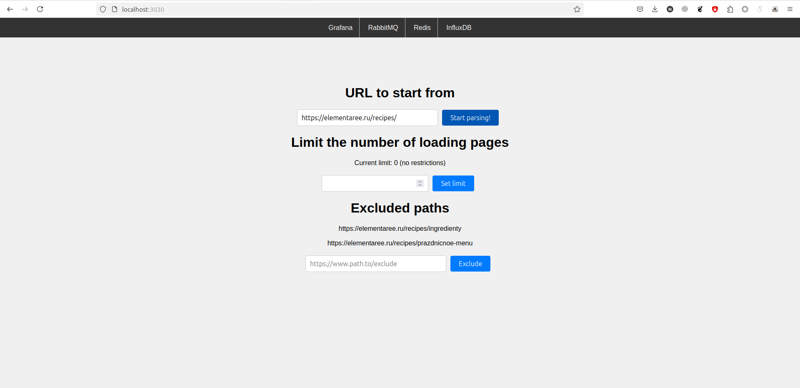
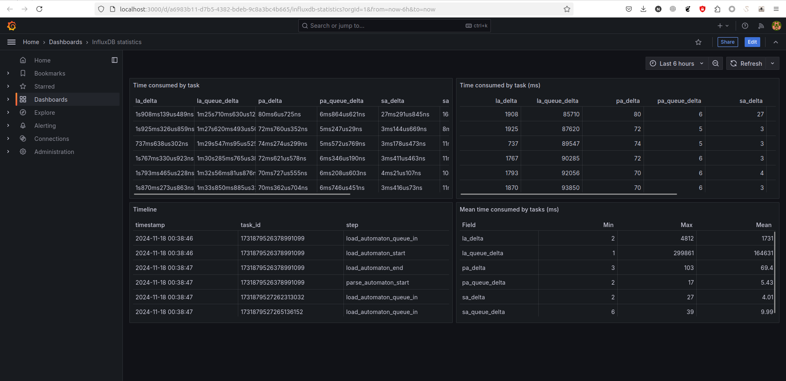

# Парсер сайтов кулинарных рецептов

### Использование
Для запуска требуется docker-compose:
```bash
cd code
docker-compose up
```

Адрес веб–интерфейса:
`http://localhost:3030/`

Адрес дэшборда $Grafana$:
`http://localhost:3000/`
`default login: admin`
`default password: password`

Входные данные:
- $URL$ начальной страницы;
- множество $URL$ начальных путей страниц, исключаемых из этапа обработки (может быть пустым);
- максимальное количество загружаемых страниц, где ноль обозначает отсутствие лимита.

Выходными данными являются загруженные в коллекцию СУБД $MongoDB$ $JSON$-документы, содержащие следующую информацию:
- $id$ — уникальный идентификатор рецепта;
- $issue\_id$ — номер задачи из $Redmine$;
- $url$ — $URL$ страницы рецепта;
- $title$ — название рецепта;
- $ingredients$ — массив ингредиентов, каждый ингредиент — словарь вида (пример на $JSON$) \texttt{\{"name": название, "unit": единица измерения, "quantity": количество\}};
- $steps$ — шаги рецепта, массив строк, одна строка — одно предложение;
- $image\_url$ — $URL$ основного изображения рецепта (если есть).

### Интерфейс
Пользовательский веб–интерфейс


Информационная панель $Grafana$


### Компоненты системы

Диаграмма связи компонентов


Приложение включает в себя следующие компоненты:
- $web$–сервер для получения, обработки и сохранения входных данных пользователя, сервис помещает в очередь новых ссылок первую задачу;
- $RabbitMQ$ — брокер сообщений, обслуживающий очередь ссылок страниц, которые необходимо загрузить, также называемую $new\_links\_queue$, очередь новых страниц $new\_documents\_queue$, которые необходимо обработать и очередь новых рецептов $new\_recipes\_queue$, которые необходимо поместить в базу данных документов;
- $MongoDB$ — предназначенная для работы с документами СУБД, хранящая обработанные рецепты в формате $JSON$;
- обслуживающий аппарат, загружающий страницы, также называемый $load\_automaton$. Сервис получает $URL$ из сообщения в очереди $new\_links\_queue$, загружает соответствующую $HTML$-страницу и помещает в очередь $new\_documents\_queue$ сообщение следующего формата \texttt{<url>:<html>}, где \texttt{<url>} и \texttt{<html>} — $URL$ загруженной страницы и её текстовое представление, всё содержимое сообщение кодируется в формате $UTF-8$;
- обслуживающий аппарат, обрабатывающий страницы, также называемый $parse\_automaton$. Сервис получает $URL$ страницы и её $HTML$ наполнение. В результате обработки сервис извлекает множество ссылок, удовлетворяющих входным данным, и добавляет новые ссылки в очередь $new\_links\_queue$, при наличии на странице рецепта, извлекает его, помещает в соответствующую структуру, сериализует и помещает в очередь $new\_documents\_queue$;
- обслуживающий аппарат, сохраняющий рецепты, также называемый $store\_automaton$. Сервис получает сериализованную структуру-представление $JSON$ рецепта, десериализует её и помещает в базу данных $parsed\_recipes$ в коллекцию $recipes$ СУБД $MongoDB$;
- $Redis$ — СУБД, хранящая множество обработанных ссылок для исключения их повторной обработки, целевой $URL$, с которым производится сравнение обрабатываемых ссылок (обрабатываемая ссылка не подлежит загрузке, если она не начинается с целевого $URL$), множество исключённых корневых $URL$ (обрабатываемая ссылка не подлежит загрузке, если она начинается хотя бы с одного исключённого $URL$), а также максимальное количество загружаемых страниц и текущее количество загруженных страниц;
- $InfluxDB2$ — СУБД, предназначенная для работы с временными рядами. Данный сервис хранит временные метки событий, связанных с началом и концом обработки задачи обслуживающими аппаратами, а также временные метки поступления задачи в очередь обслуживающего аппарата, загружающего страницы;
- $Grafana$ - $BI$-инструмент, позволяющий получить такую информацию, как среднее время обработки задачи отдельными обслуживающими аппаратами, среднее время ожидания задачи в каждой очереди и среднее время от начала до конца существования задачи. Перечисленная статистика доступна только для задач, прошедших через все обслуживающие аппараты, остальные задачи в статистике не учитываются.


Диаграмма последовательности:


